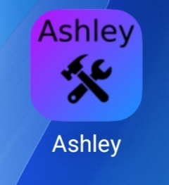
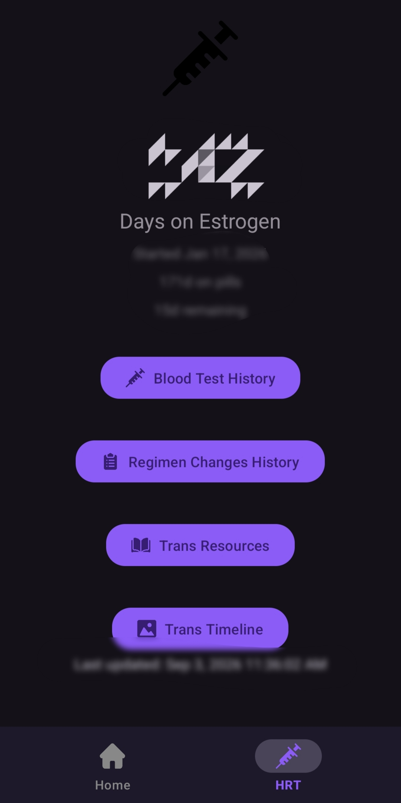
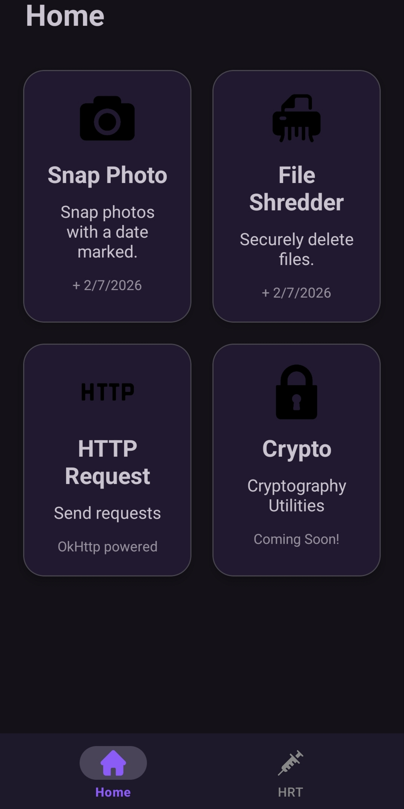

# Ashley.apk

i use this application because some features i need are not available in default android

# Features
- Watermarked Photos (snap photos with the date printed on the bottom side)
- Shred files (permanently delete files - unrecoverable)
- Send Http Requests (useful for testing)
- Crypto Toolbox (for those who need cryptography features)
- HRT Tracker

